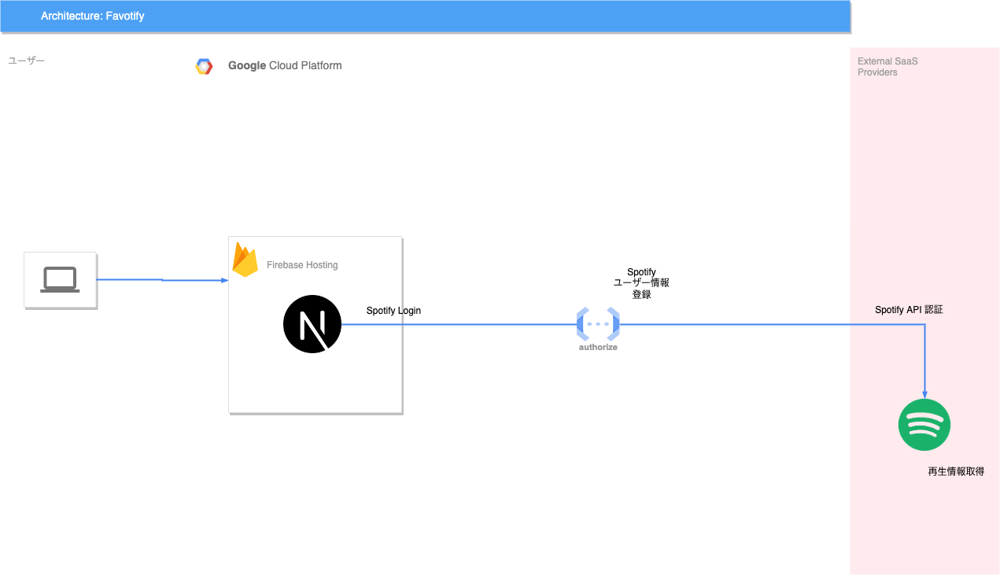

# favotify
Spotifyで今週一番再生した曲をTwitterに投稿するbotサービス


- [figma](https://www.figma.com/file/XdjEpS4faSqNDM9P2t1HgM/Favotify?node-id=0%3A1&t=NVLU2ZiJAaHxK22o-1)

## Environment
|tool|version|
|--|--|
|node|v18.12.1|
|npm|8.19.2|
|yarn|1.22.19|

# Getting Started

- リポジトリからクローンしてきたとき
```bash:
yarn install
```

- firebase-cliのインストール
```bash:
npm install -g firebase-tools

# Next.js用の機能有効化
# GitHub Actionsでのデプロイがうまくいかないため行わない
# npx firebase experiments:enable webframeworks
```

- ローカルでのサーバ立ち上げ
```bash:
yarn dev
```

- firebase へデプロイ
```bash:
npx firebase deploy
```

## Tips
- UIに関してはChakura UIを採用している
  - [Chakra UI - A simple, modular and accessible component library that gives you the building blocks you need to build your React applications. - Chakra UI](https://chakra-ui.com/)
    - 公式ページ
  - [Chakra Templates](https://chakra-templates.dev/)
    - テンプレート集

### 旧リポジトリ

- [Favotify](https://github.com/klsh1tt/Favotify)


